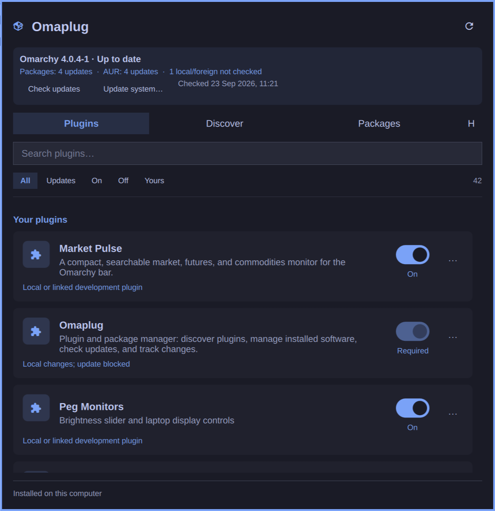
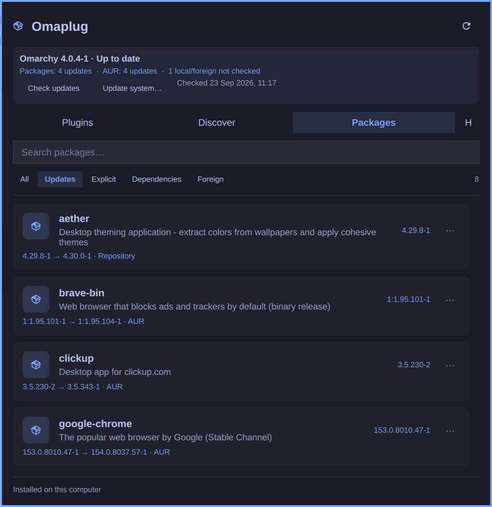
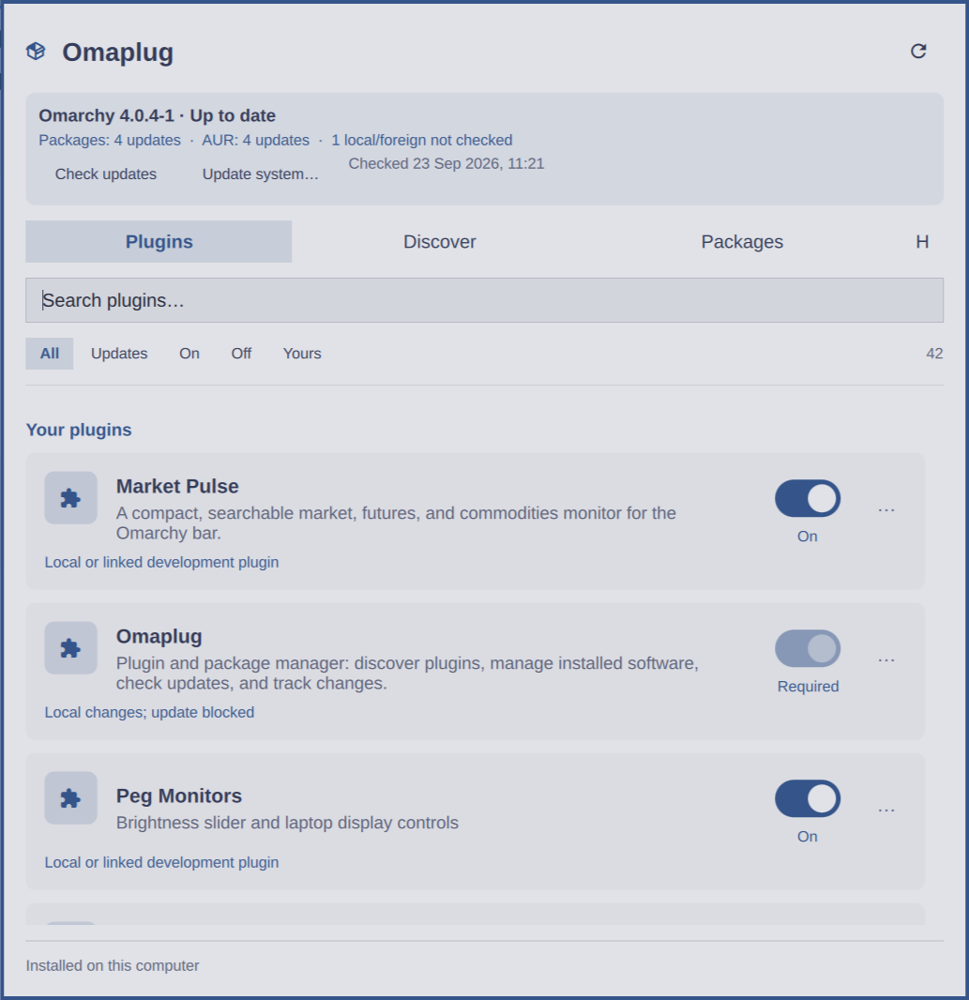
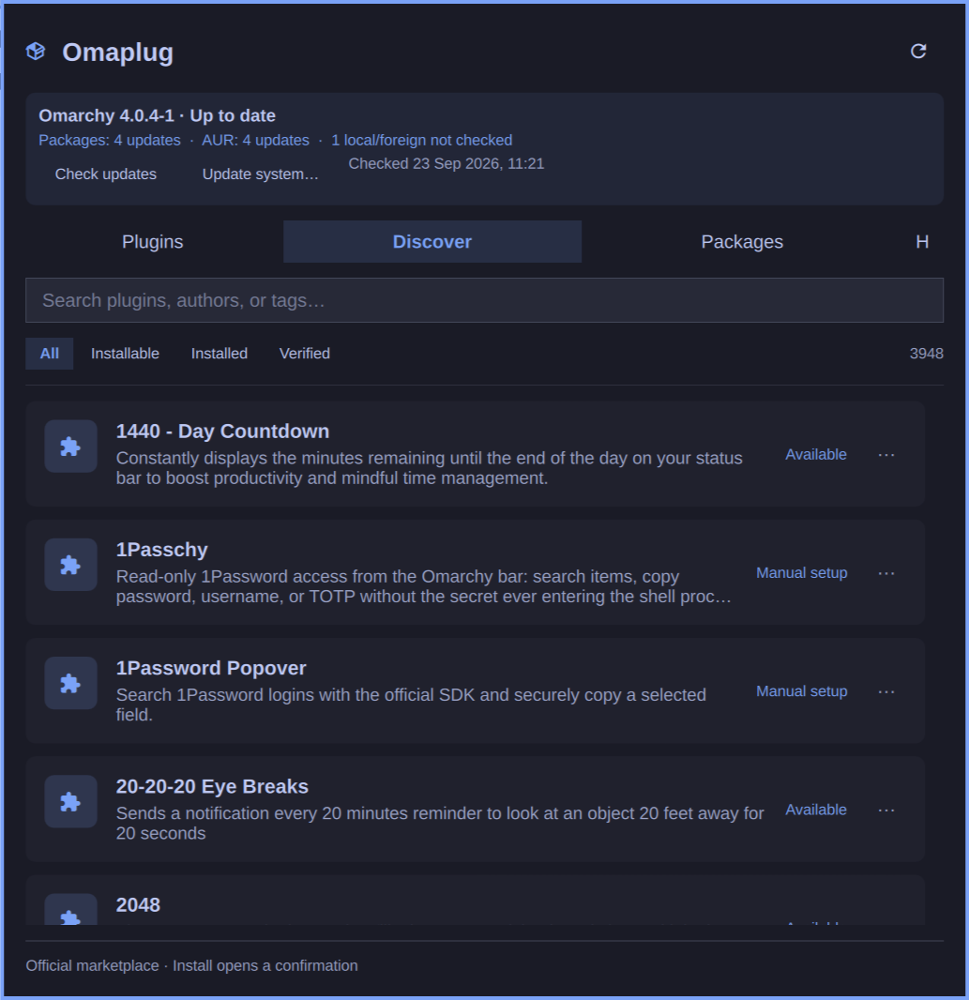
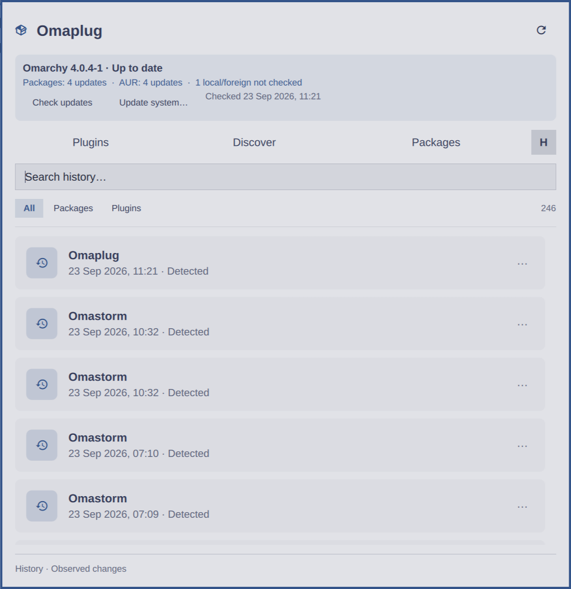

# Omaplug: Plugin & Package Manager

**Your plugins. Your packages. One clear panel.** Discover and install plugins, switch them on or off, inspect installed packages, check available updates, and track what changed, right from your Omarchy bar. Readable, theme-aware views keep everyday software management close at hand.

This repository contains the current **1.2.0** community plugin, including its tests, screenshots, and known limitations. It is not an official Omarchy component or an accepted upstream contribution.



## What you can do

- **Manage plugins:** visible On/Off switches, safe removal, and individual updates through Omarchy's review prompt.
- **Discover plugins:** search the official marketplace and install eligible plugins without leaving the panel to find them.
- **Manage installed packages:** search, inspect versions and metadata, filter available updates, and remove eligible software with confirmation.
- **See independent updates:** installed Omarchy version, repository package updates, and AUR release updates. Package updates remain visible when Omarchy itself is up to date.
- **Understand changes:** package transactions and detected plugin changes in the compact **H** history view.



## Update checks

Opening the panel checks updates if the cached result is older than 15 minutes. **Check updates** forces a fresh check. This is separate from the 30-second local inventory monitor. Repository checks use `checkupdates` and its isolated database, not a system database-only refresh. AUR release versions come from the public AUR RPC service; installed foreign-package names are sent to AUR for matching. Local inventory and history are not uploaded wholesale. VCS rebuilds are not detected, and foreign packages absent from AUR are labeled not checked.

The header shows independent Omarchy, repository-package, and AUR statuses. **Packages → Updates** lists installed → available versions. Failed sources retain last-known rows marked stale; a failed check is never reported as up to date. Hover **Check updates** for source errors and last-success times.

**Update system…** opens the full native `omarchy update` workflow, including package updates even when no new Omarchy version exists. It retains confirmation, authentication, the native update lock, and restart checks. It does not selectively upgrade individual packages. No update is installed by merely opening this panel.

**Plugins → Updates** lists clean fast-forward updates. Checks fetch Git metadata from HTTPS GitHub origins without changing installed source. Modified, diverged, linked/development, non-Git and unsupported-origin installations show their limitations instead of an update button. **Update plugin…** rechecks eligibility and launches native interactive review; upstream changes are not a guarantee of marketplace verification. Bulk plugin updates and arbitrary package installation are not included.

## Install

Install through Omarchy's plugin manager:

```bash
omarchy plugin add https://github.com/Pegorim/omaplug.git --enable
```

Omarchy presents its normal review and confirmation prompts, validates the manifest, and downloads the plugin directly into the regular plugin directory:

```text
~/.config/omarchy/plugins/mateus.omaplug/
```

The `--enable` option adds Omaplug to your bar. Click its package icon to open the panel.

Verified with Omarchy **4.0.4-1**, Quickshell **0.3.1-1**, Python **3.14.7**, and the native Omarchy shell components on the test machine. Older Waybar-based installations are not supported. Omaplug uses Python's standard library, pacman, pacman-conf, vercmp, checkupdates (pacman-contrib), and Git. Missing check tools are reported as errors rather than an up-to-date status.

## Browse your software

Plugin rows have always-visible **On/Off switches**. Your plugins appear first, followed by bundled components. Flip a switch directly, or focus it and press Space. Omaplug waits for Omarchy to confirm the change; pending operations show “Saving…” and failures appear in the panel. Required shell components, replacement bars, and Omaplug itself cannot be switched here. Turning a plugin off does not uninstall it.

The interface uses the system sans-serif font, larger name text, two-line descriptions, and softly separated rows. Colors bind to Omarchy's live accent, foreground, background, and error roles, including the active switch and selected navigation. No desktop font or theme settings are changed.

Omaplug opens on **Plugins**. The three main views are **Plugins**, **Discover**, and **Packages**. The compact **H** button at the far right opens History; click it again or press **Ctrl+H** to return. Each view remembers its search, filter, expanded row, and selected position for the current shell session. A single result count sits beside the filters; descriptions stay visible, while technical details and removal actions appear only when expanded.

- **Packages:** search names, descriptions, and versions. Filter by explicit packages, dependencies, or foreign packages. Expand a row for installed size and package metadata.
- **Plugins:** inspect enabled status, bundled/user origin, manifest version, local revision, and source location. This includes Omarchy shell plugins, not editor or AI extensions.
- **Discover:** search the official marketplace by name, author, category, or tags. Filter by installable, installed, or verified snapshots. Expand a plugin to install it or open its repository.
- **History:** browse grouped package transactions and detected plugin changes. Expand a transaction for individual changes and old/new versions. The panel displays the most recent 500 entries; older recorded entries remain in SQLite.

Foreign means absent from the currently available sync databases. Such packages can come from AUR or local package files. Repository classification does not prove the original installation source. Pacman's installation date describes the most recent install or upgrade, not necessarily the first install.

Search receives focus when the panel opens. Use **Down/Up** to browse results, **Enter** or **Space** to expand, **Ctrl+F** to return to search, **Ctrl+1/2/3/4** to switch tabs, **Tab/Shift+Tab** to move between controls, and **Escape** to close. Click Refresh, or middle-click the bar icon, for a fresh observation.



## Install from the marketplace

Open **Discover** (Ctrl+4), search, expand a plugin, and choose **Install…**. Omaplug opens a terminal and hands off to `omarchy plugin add <repository> --enable`. Omarchy retains its review/confirmation, validation, duplicate-ID protection, and bar placement prompts. The inventory refreshes afterward. No plugin is installed simply by browsing.

The catalog comes from `https://plugins.omarchy.org/catalog.json`, on demand when Discover opens, with a 15-minute in-memory freshness window. Refresh fetches it again. No inventory is uploaded. Failed requests retain the last loaded list and show an error; installation re-fetches the catalog and rechecks availability, repository identity, and the installed inventory before starting. Offline installation is not supported.

All catalog entries can be browsed. Direct installation is available only for currently available root plugins with the marketplace's automatic-install flag. Manual-setup plugins, suites, multi-plugin repositories, and unavailable entries link to their upstream instructions instead. Bundled plugins are managed in the installed Plugins tab. Existing installations cannot be overwritten from Discover.

Verification badges describe the marketplace snapshot; **Update unverified** is not treated as verified. Omarchy installs current upstream code, not a pinned verified commit. Omaplug constructs a fixed argument list from a validated GitHub repository URL and never runs catalog-provided command strings.



## What history can tell you

Package history is imported from the configured pacman log. Transactions without a completion marker are explicitly marked as unconfirmed. Log rotation preserves already-recorded history, but activity in unavailable older logs cannot be recovered. Identical transactions within the same timestamp may be indistinguishable in pacman's second-resolution log.

Plugin history begins with Omaplug's first observation. Existing plugins are a baseline, not newly installed software. Changes are checked every 30 seconds while the enabled plugin's shell service runs, and when the panel opens or the registry changes. Detection times are not exact installation times. Short-lived changes between observations can be missed; disabling Omaplug or closing the desktop stops observation. A gap longer than two minutes is noted in the history footer.

The monitor does not fetch Git repositories or check available upgrades. A revision change is a change of the local Git HEAD; uncommitted source edits are not installation events. A missing registry entry whose files remain is treated as an uncertain scan, preserving the previous plugin inventory instead of claiming removal.

Source failures retain previous results and display a stale notice. Corrupt SQLite state is left intact and reported, never silently replaced. Inventory collection is read-only; removal runs separately and requires confirmation.

## Remove software

Expand a package or plugin and choose **Remove…**. A terminal opens with Omarchy's themed `gum confirm` Yes/No prompt, defaulting to **No**. No or Escape cancels without making changes. Yes rechecks eligibility and starts removal, without a second confirmation. The inventory refreshes afterward.

- Bundled plugins are labeled and protected. Plugins that the shell marks as required, and Omaplug itself, are also protected. Removal is limited to regular installations in Omarchy's user plugin folder, and refuses repositories with local changes.
- Bundled package labels come from Omarchy's installed default package list plus its core metapackages. The optional ISO package list is not treated as proof that an application is bundled.
- Critical protection covers known core system, desktop, boot, networking, filesystem, and monitor runtime packages, installed kernel package names, and their dependency providers. Packages required by other installed software are also blocked. This conservative policy does not identify every dependency in custom scripts or personal workflows.
- Eligible packages use `pacman -R`, with dependency checks intact. The native command's extra prompt is suppressed only after Yes in the Gum prompt. Removal never automatically removes dependencies or forces a transaction. Eligible bundled applications carry a notice before the prompt.

Removal eligibility is checked again against current system data when the terminal opens. Missing safety data blocks removal. Package authentication uses Omarchy's askpass helper.



## State and diagnostics

State is stored in Omarchy's state directory at `${XDG_STATE_HOME:-$HOME/.local/state}/omarchy/omaplug/history.sqlite3`, with private file permissions. Bar placement and enabled status use Omarchy's existing `~/.config/omarchy/shell.json`. There is no separate daemon or system service. All monitors share one shell service.

Version 1.0.1 automatically copies existing history from the former `omaplug/history.sqlite3` location under the state root on first use. The original remains as an inactive recovery copy; an existing database at the new location is never overwritten. New installations write only inside Omarchy's directories.

```bash
omarchy-shell omaplug-monitor status
omarchy-shell omaplug-monitor refresh
omarchy-shell mateus.omaplug open
omarchy-shell mateus.omaplug close
```

The helper reads a single JSON line from stdin and emits a `schemaVersion: 1` JSON snapshot with `packages`, `plugins`, `history`, source freshness, and errors. With `{}` as input, it reads enabled status through `omarchy plugin list --json` and joins manifest metadata from `omarchy-plugin-catalog`. This supports Omarchy's restricted per-plugin registry API. Tests may supply a `plugins` array instead. Plugin-list failures preserve the previous plugin inventory while package collection continues. Helper calls are serialized, commands have timeouts, and package metadata is rescanned only when the local database signature changes.

To disable the monitor:

```bash
omarchy plugin disable mateus.omaplug
```

To remove the plugin through Omarchy's normal confirmation flow:

```bash
omarchy plugin remove mateus.omaplug
```

This removes the downloaded plugin checkout. Omaplug's history remains in its separate state directory.

## Development and checks

```bash
python3 -m unittest discover -s tests -v
node tests/test_model.cjs
```

Node is only used for the model tests, not at runtime. The tests cover package parsing, transaction grouping, partial lines, rotation, repeated timestamps, replay deduplication, plugin baselines and changes, uncertain scans, source failures, database locking, state preservation, and filtering 10,000 packages.

Installation and updates use Omarchy's native plugin manager. There is no custom installer or required development checkout location.

`tests/Preview.qml` is an isolated Quickshell preview using a supplied snapshot. It supports light-palette, tab, and size/position checks without touching desktop theme settings. Run `python3 tests/preview.py` after the installed monitor has collected its first snapshot. Preview IPC is scoped to its temporary config; it is not loaded by the installed plugin.

**Source reload limitation:** on the tested shell, a plugin rescan sometimes retained compiled QML from before an edit. Use `omarchy restart shell` after editing source if the panel does not update. Python helper changes take effect on the next observation. History survives shell restarts.

Visual checks covered the native dark palette, an isolated light palette, the three tabs, expanded history, keyboard search, and a narrow panel. See [VALIDATION.md](VALIDATION.md) for the precise results and remaining limitations.

The [upstream proposal draft](UPSTREAM.md) records the idea for a future Omarchy contribution. Publishing this standalone repository does not imply an upstream submission, acceptance, or release inclusion.

### UX references

The readable title/subtitle/control hierarchy follows the [GNOME switch-row pattern](https://developer.gnome.org/hig/patterns/containers/boxed-lists.html) and [typography guidance](https://developer.gnome.org/hig/guidelines/typography.html). Omaplug retains a virtualized list for its dynamic inventory, a separate details action, and Omarchy-native state changes.
